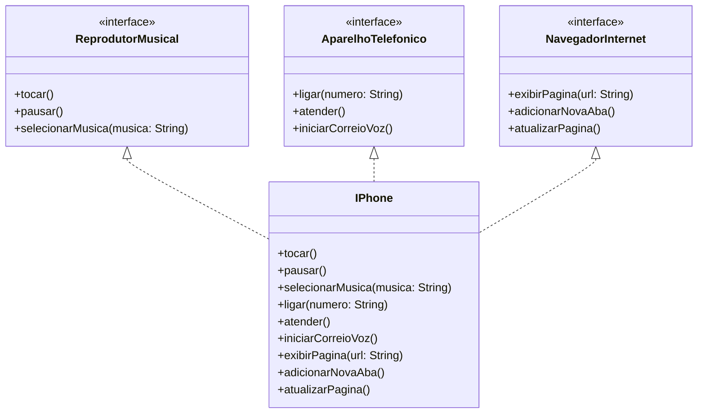

# 📱 Desafio de Modelagem e Diagramação - Componente iPhone

## 📝 Descrição

Este projeto representa a modelagem UML do componente **iPhone**, inspirado no vídeo de lançamento original de 2007. O iPhone foi modelado com três funcionalidades principais:

- 🎵 Reprodutor Musical  
- 📞 Aparelho Telefônico  
- 🌐 Navegador de Internet

---

## 📐 Diagrama UML

Você pode visualizar o diagrama UML neste link:  
🔗 [MermaidChart - Diagrama UML](https://www.mermaidchart.com/app/projects/8d7688cb-75f3-4cac-ba4e-542b92bb0d66/diagrams/de80fa61-dbba-46a9-9323-48e193b6ea06/version/v0.1/edit)




---

## 💻 Linguagem Utilizada

- Java (para implementação das interfaces e da classe `IPhone`)

---

## 📁 Estrutura de Pastas

```text
/iphone-componente
├── README.md
├── ReprodutorMusical.java
├── AparelhoTelefonico.java
├── NavegadorInternet.java
└── IPhone.java
```

---

